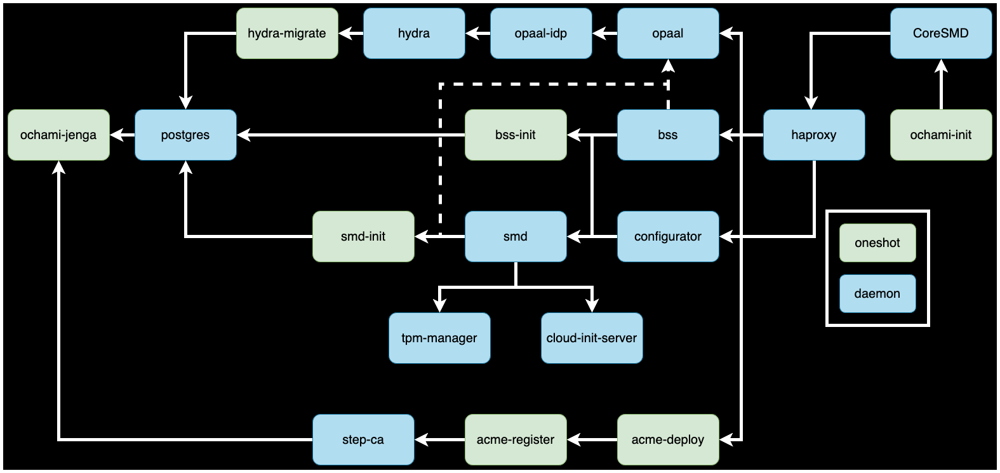

# Ochami Bootcamp
This Doc is a very brief tutorial on how to deploy OpenCHAMI

## Assumptions

### A running OS
I think we all know how to install a linux OS on a machine at this point.

### Config Management
We'll go over some config management, but it will not be a full system deployment. Anything beyond basic booting functions will not be covered

### Cluster Images
OpenCHAMI doesn't provide an image build system. It relies on external images being available.  
We'll go over how we are building images locally but they won't be full production-like images

## Prep
Some stuff we need before we start deploying OpenCHAMI

### Package installs
```bash
dnf install -y ansible git podman jq
```
### Setup hosts
Clusters generally have names. This cluster is named `demo` and the shortname for our nodes is `nid`. Feel free to be creative on your own time.  
The BMCs are named `<shortname>-bmc`. 
Make your `/etc/hosts` look something like
```bash
172.16.0.254    demo.openchami.cluster
172.16.0.1      nid001
172.16.0.2      nid002
172.16.0.3      nid003
172.16.0.4      nid004
172.16.0.5      nid005
172.16.0.6      nid006
172.16.0.7      nid007
172.16.0.8      nid008
172.16.0.9      nid009
172.16.0.101    nid-bmc001
172.16.0.102    nid-bmc002
172.16.0.103    nid-bmc003
172.16.0.104    nid-bmc004
172.16.0.105    nid-bmc005
172.16.0.106    nid-bmc006
172.16.0.107    nid-bmc007
172.16.0.108    nid-bmc008
172.16.0.109    nid-bmc009
```

### powerman + conman
Install the things
```bash
dnf install -y powerman conman jq
```
Configure `/etc/powerman/powerman.conf`, remember your cluster shortnames. User/Password should be the same on all systems
```bash
include "/etc/powerman/ipmipower.dev"

device "ipmi0" "ipmipower" "/usr/sbin/ipmipower -D lanplus -u admin -p Password123! -h nid-bmc[001-009] -I 17 -W ipmiping |&"
node "nid[001-009]" "ipmi0" "nid-bmc[001-009]"
```
Start and enable powerman:
```bash
systemctl start powerman
systemctl enable powerman
```
Then Check to make sure you can see the power state of the nodes
```bash
pm -q
```

Conman is next. Configure your `/etc/conman.conf`. You may have to zero out that file first.
Should look something like the below, with your cluster shortname in place.
```bash
SERVER keepalive=ON
SERVER logdir="/var/log/conman"
SERVER logfile="/var/log/conman.log"
SERVER loopback=ON
SERVER pidfile="/var/run/conman.pid"
SERVER resetcmd="/usr/bin/powerman -0 %N; sleep 5; /usr/bin/powerman -1 %N"
SERVER tcpwrappers=ON

GLOBAL seropts="115200,8n1"
GLOBAL log="/var/log/conman/console.%N"
GLOBAL logopts="sanitize,timestamp"

# Compute nodes
CONSOLE name="nid001" dev="ipmi:nid-bmc001" ipmiopts="U:admin,P:Password123!,C:17,W:solpayloadsize"
CONSOLE name="nid002" dev="ipmi:nid-bmc002" ipmiopts="U:admin,P:Password123!,C:17,W:solpayloadsize"
CONSOLE name="nid003" dev="ipmi:nid-bmc003" ipmiopts="U:admin,P:Password123!,C:17,W:solpayloadsize"
CONSOLE name="nid004" dev="ipmi:nid-bmc004" ipmiopts="U:admin,P:Password123!,C:17,W:solpayloadsize"
CONSOLE name="nid005" dev="ipmi:nid-bmc005" ipmiopts="U:admin,P:Password123!,C:17,W:solpayloadsize"
CONSOLE name="nid006" dev="ipmi:nid-bmc006" ipmiopts="U:admin,P:Password123!,C:17,W:solpayloadsize"
CONSOLE name="nid007" dev="ipmi:nid-bmc007" ipmiopts="U:admin,P:Password123!,C:17,W:solpayloadsize"
CONSOLE name="nid008" dev="ipmi:nid-bmc008" ipmiopts="U:admin,P:Password123!,C:17,W:solpayloadsize"
CONSOLE name="nid009" dev="ipmi:nid-bmc009" ipmiopts="U:admin,P:Password123!,C:17,W:solpayloadsize"
```
Then start and enable `conman`
```bash
systemctl start conman
systemctl enable conman
```

At this point you can test powering on a node and check that conman is working
```bash
pm -1 nid001
conman nid001
```
You should at least see console output, but it won't boot just yet...


## OpenCHAMI microservices
OpenCHAMI is a long acronym for something that is probably a lot more simple than you would expect. OpenCHAMI is ostensibly based on CSM but really we took SMD and BSS and that's about it. 

### SMD
State Management Database (SMD), at least that is what I think SMD stands for, is a set of APIs that sit in front of a Postgres database. SMD does a lot more in CSM than it does in OpenCHAMI. There is no hardware discovery happening in SMD and we don't use it for holding the state of anything. SMD is simply an API that talks to a database that holds component information. The components here are Nodes, BMCs, and Interface data. 
In OpenCHAMI SMD does not actively do anything and is a repository of information on the system hardware. 
### BSS
BootScript Service (BSS) is a service that provides on demand iPXE scripts to nodes during the netboot process. It talks to SMD to confirm the requesting node exists and if so it returns a generated iPXE script based on the data it holds about that node. 
### Cloud-init
We wrote a custom cloud-init server that does some things similar to BSS. It will process the requesting nodes IP and find the component and/or group information, then build the cloud-init configs from there. Cloud-init data is populated externally. OpenCHAMI does not provide the actual configs only a way to push out the configs. 

The server has two endpoints: `/cloud-init` and `cloud-init-secure`. Aptly named, the secure functions like the regular endpoint but requires a JWT to read from it. This is how we are providing secret data to the cluster nodes. 
### TPM-manager
Not so aptly named, this service is a weird one. It's inital function was to experiment on configuring TPMs during boot. But some of the test systems did not have TPMs and so it's basic function is to generate a JWT and push it to the nodes during boot. 
### dnsmasq-load and dnsmasq
OpenCHAMI doesn't have it's own DHCP implementation and that is intentional. We try leverage existing software where we can and dnsmasq was our first attempt at integrating DHCP.
The only customization is we added was the dnsmasq-loader. It runs a python script every minute to read from SMD and populate the dnsmasq config.

### opaal and Hydra
#### Hydra
[Hydra](https://github.com/ory/hydra) is an oauth provider but it does not manage logins or user accounts etc. We use Hydra to create and hand out JWTs.

### opaal
Opaal is a toy OIDC provider. You make a request to opaal and it makes a JWT request to hydra, then hands that back to the "user". It's a pretend login service.

Hydra is something that will probably stick around for a while as we use it as the authorization server. opaal is a stand in service that will probably get replaced, hopefully soon.
So I wouldn't worry too much about opaal.
### ACME and step-ca
Automatic Certificate Management Environemnt or ACME is what we use to automate CA cert renewals. This is so you don't have that special day every year when all your certificates expire and you have to go renew them and it's annoying. Now you have to renew them everyday! but it should be "automatic" and much easier. I say that but we only issue a single cert at the moment, so time will tell. We use [acme.sh](https://github.com/acmesh-official/acme.sh) to generate certs from a certificate authority. 

[step-ca](https://smallstep.com/docs/step-ca/) is the certificate authority we use to generate CA certs. 
### haproxy
HAproxy acts our API gateway. It's what allows outside requests to reach into the container network and talk to various OpenCHAMI services. 
### postgres
We use postgres as the backend for BSS, SMD, and Hydra. It's just a postgres database in a container. 

## OpenCHAMI adjacent techonologies
OpenCHAMI doesn't exist in a vacuum. There are parts of deploying OpenCHAMI that are not managed by OpenCHAMI. 
We'll cover some of these briefly. Very Briefly. 

### DHCP and iPXE and Dracut
These are all important parts of the boot process. 

#### DHCP
DHCP is all over the place so I'm not gonna go over what DHCP is. OpenCHAMI provides a couple options for DHCP but there is no OpenCHAMI DHCP implementation. 
We have DHCP containers available but these are built on top of pre-existing DHCP implementations. This tutorial will be using dnsmasq.
One other option is using coreDHCP. We blur the lines here a bit because we have written a coreDHCP plugin to work with the OpenCHAMI services. 
We will not be using coreDHCP here though. 

#### iPXE
iPXE is also something we should all be familiar with. OpenCHAMI interacts with iPXE via BSS, as explained above, but does not control the entire workflow.

We continue to use iPXE because it is in all firmware at this point. HTTP booting is becoming more popular but not all vendors are building that into their firmware just yet. 

#### Dracut
OpenCHAMI doesn't directly interact with the dracut init stage, but we can insert parameters into BSS that can have an effect here. 
One example is NFS provided rootfs. 

#### Boot process
A summary of the boot process can be seen here


### Containers and Microservices
Miscroservices in very few words are defined by two concepts:
- Independently deployable
- Loosely coupled

Think of it as building a castle with lego pieces instead of carving it out of a single piece of word or something. 
A good, in depth overview of microservices can be found [here](https://microservices.io/)

Containers are pretty ubiquitous now and I'm sure we've all had some ratio of positive and negative experiences.
There are a lot of container orchestrators ranging from fairly simple like Docker and Podman to more complicated like Kubernetes. 
OpenCHAMI DOES NOT CARE about whatever orchestrator you choose to use. The strategy recommonded is to follow the opt-in complexity model.
In other words, don't start with the most complicated deployment, start simple.

The OpenCHAMI microservices are distributed as containers which allow for a flexible deployment model. 
You can see all the available OpenCHAMI containers [here](https://github.com/orgs/OpenCHAMI/packages)

The Deployment we'll use in this guide will leverage container volumes and networks to hold persistent data and route traffic accordingly. 

## Deploying OpenCHAMI
We have a set of [Deployment Recipes](https://github.com/OpenCHAMI/deployment-recipes.git) available on the [OpenCHAMI GitHub](https://github.com/OpenCHAMI). 
We are going to use a specific one, the LANL [podman-quadlets](https://github.com/OpenCHAMI/deployment-recipes/tree/trcotton/podman-quadlets/lanl/podman-quadlets) recipe. We will have to modify some of the configs to match our cluster, but we'll get to that.  
First pull down the deployment-recipes repo from the OpenCHAMI GitHub.
```bash
git clone https://github.com/OpenCHAMI/deployment-recipes.git
```
Go to the cloned repo and the LANL podman-quadlets recipes
```bash
cd deployment-recipes/lanl/podman-quadlets
```
Here will have to make some local changes that match your system

### Setup the inventory
The inventory is a single node so just change `inventory/01-ochami` and set
```ini
[ochami]
st-head.si.usrc
```
To be the value of `hostname` (st-head.si.usrc in this case).  

### Set cluster names
Pick a cluster name and shortname. These examples use `demo` and `nid` respectively.  
These are set in `inventory/group_vars/ochami/cluster.yaml`
```yaml
cluster_name: "demo"
cluster_shortname: "nid"
```

### Setup a private SSH key pair
Generate an SSH key pair if one doesn't exist
```bash
ssh-keygen
```
Just hit enter 'til you get the prompt back.  
Now we take the contents of `~/.ssh/id_rsa.pub` and set it in our inventory.  
In `inventory/group_vars/ochami/cluster.yaml`
```yaml
cluster_boot_ssh_pub_key: 'ssh-rsa AAAAB3NzaC1yc2EAAAADAQABAAABgQDZW66ja<snip> = root@st-head'
```
 Replace what is there with what `ssh-keygen` created. Make sure it is the pub key. 

### Populate nodes
Now we need to populate `inventory/group_vars/ochami/nodes.yaml`. This describes your cluster in a flat yaml file. 
It will look something like:
```yaml
nodes:
  - bmc_ipaddr: 172.16.0.101
    ipaddr: 172.16.0.1
    mac: ec:e7:a7:05:a1:fc
    nid: 1
    xname: x1000c1s7b0n0
    group: compute
    name: nid001
```
Your clusters have 9 computes, so you will have 9 entries. 
The really important bits here are the MACs. Everything else is made up and you can mostly leave it alone except for the `name`, which you should change to match your `cluster_shortname`. 

#### Getting the MACs
We are gonna grab the MACs from redfish. 
Make a script `gen_nodes_file.sh` (and you guys are gonna be so impressed)
```bash
#!/bin/bash
nid=1
SN=${SN:-nid}
echo "nodes:"
for i in {1..9}
do
	NDATA=$(curl -sk -u $rf_pass https://172.16.0.10${i}:443/redfish/v1/Chassis/FCP_Baseboard/NetworkAdapters/Nic259/NetworkPorts/NICChannel0)
	if [[ $? -ne 0 ]]
	then
		>&2 echo "172.16.0.10${i} unreachable, generating a random MAC"
		RMAC=$(printf '02:00:00:%02X:%02X:%02X\n' $((RANDOM%256)) $((RANDOM%256)) $((RANDOM%256)))
		NDATA="{\"AssociatedNetworkAddresses\": [\"$RMAC\"]}"
	fi
	MAC=$(echo $NDATA | jq -r '.AssociatedNetworkAddresses|.[]')
	echo "- bmc_ipaddr: 172.16.0.10${i}
  ipaddr: 172.16.0.${i}
  mac: ${MAC}
  nid: ${nid}
  xname: x1000c1s7b${i}n0
  group: compute
  name: ${SN}00${i}"

  	nid=$((nid+1))
done
```
Set the follow variables
```bash
export SN=<cluster-shortname>
export rf_pass="admin:Password123!"
``` 
Then `chmod +x gen_nodes_file.sh` and run it
```bash
gen_nodes_file.sh > nodes.yaml
```
If a node's BMC does not respond it will generate a MAC address, You can fix it later. 
You can then copy that to your ansible inventory (and replace the nodes.yaml that is there).

### Running the OpenCHAMI playbook
Almost done. Run the provided playbook with the `configs` tag:
```bash
ansible-playbook -l $HOSTNAME -c local -i inventory -t configs ochami_playbook.yaml
```
Once the system is back up, run the full playbook
```bash
ansible-playbook -l $HOSTNAME -c local -i inventory ochami_playbook.yaml
```

Should take a minute or two to start everything and populate the services.  
At the end you should have these containers running:
```bash
# podman ps | awk '{print $NF}' | sort
bss
cloud-init-server
dnsmasq
dnsmasq-loader
haproxy
hydra
image-server
NAMES
opaal
opaal-idp
postgres
smd
step-ca
tpm-manager
```

### Verifying things look OK
The playbook created a profile script `/etc/profile.d/ochami.sh`. So unless you logout and back in you'll be missing some ENV settings. You can also just `source /etc/profile.d/ochami.sh` without logging out. 

Create a CA cert
```bash
get_ca_cert > /etc/pki/ca-trust/source/anchors/ochami.pem
update-ca-trust 
```
The cert will expire in 24 hours. You can regenerate certs with
```
systemctl restart acme-deploy
systemctl restart acme-register
systemctl restart haproxy
```
This would go great in a cron job.

Generate an ACCESS_TOKEN. This is used in the rest of the commands
```bash
export ACCESS_TOKEN=$(gen_access_token)
```
We're going to interact with the OpenCHAMI services using `ochami-cli`.  
It's not super great but it functions. 
```bash
ochami-cli --help
```

Check SMD is populated with `ochami-cli smd --get-components`
```bash
BMC:  x1000c1s7b[0-8]
Compute:  x1000c1s7b[0-8]n0
```

Check BSS is populated with `ochami-cli bss --get-bootparams`
```bash
nodes: nid[1-9]
kernel:  http://172.16.0.254:8080/openchami/rocky/v1/vmlinuz-4.18.0-553.22.1.el8_10.x86_64
initrd:  http://172.16.0.254:8080/openchami/rocky/v1/initramfs-4.18.0-553.22.1.el8_10.x86_64.img
params:  root=live:http://172.16.0.254:8080/openchami/rocky/v1/rootfs-4.18.0-553.22.1.el8_10.x86_64 ochami_ci_url=http://172.16.0.254:8081/cloud-init/ ochami_ci_url_secure=http://172.16.0.254:8081/cloud-init-secure/ overlayroot=tmpfs overlayroot_cfgdisk=disabled nomodeset ro ip=dhcp apparmor=0 selinux=0 console=ttyS0,115200 ip6=off network-config=disabled rd.shell
```
We'll have to update these values later when we build a test image. But for now we can see that it is at least working...

Check cloud-init is populated with `ochami-cli cloud-init --get-ci-data --name compute`
```yaml
cloud-init:
  metadata:
    instance-id: test
  userdata:
    runcmd:
    - setenforce 0
    - systemctl disable firewalld
    write_files:
    - content: ssh-rsa AAAAB3NzaC1yc2EAAAADAQABAAABgQDZW66ja<snip> = root@st-head'
      path: /root/.ssh/authorized_keys
  vendordata: {}
name: compute
```
We only setup authorized keys on the computes for now. 

### Building a test image
We'll build a test image real quick to boot into. Won't be anything special.

First install `buildah`
```bash
dnf install -y buildah
```
Create a blank container
```bash
CNAME=$(buildah from scratch)
```
Mount it 
```bash
MNAME=$(buildah mount $CNAME)
```
Install some base packages
```bash
dnf groupinstall -y --installroot=$MNAME --releasever=8 "Minimal Install"
```
Install the kernel and some need dracut stuff:
```bash
dnf install -y --installroot=$MNAME kernel dracut-live fuse-overlayfs cloud-init
```
Then rebuld the initrd so that during dracut it will download the image and mount the rootfs as an in memory overlay
```bash
buildah run --tty $CNAME bash -c ' \
    dracut \
    --add "dmsquash-live livenet network-manager" \
    --kver $(basename /lib/modules/*) \
    -N \
    -f \
    --logfile /tmp/dracut.log 2>/dev/null \
    '
```
Then commit it
```bash
buildah commit $CNAME test-image:v1
```
While we're here we'll get the initrd, vmlinuz, and build a rootfs to boot from. 
We have a container that holds all three of these items we just need to pull them out. 

Setup a directory to store these. We'll use an nginx container to serve these out later on.
```bash
mkdir -p /data/domain-images/openchami/rocky/test
```

Get the kernel version of the image
```bash
KVER=$(ls $MNAME/lib/modules)
```
If you have more than one kernel installed then something went very wrong

Get the initrd and vmlinuz
```bash
cp $MNAME/boot/initramfs-$KVER.img /data/domain-images/openchami/rocky/test
chmod o+r /data/domain-images/openchami/rocky/test/initramfs-$KVER.img
cp $MNAME/boot/vmlinuz-$KVER /data/domain-images/openchami/rocky/test
```

Now let's make a squashfs of the rootfs
```bash
mksquashfs $MNAME /data/domain-images/openchami/rocky/test/rootfs-$KVER -noappend -no-progress
```

After all this you should have something that looks like so
```bash
[root@st-head ~]# ls -l /data/domain-images/openchami/rocky/test/
total 1244104
-rw----r-- 1 root root  102142693 Oct 16 09:04 initramfs-4.18.0-553.22.1.el8_10.x86_64.img
-rw-r--r-- 1 root root 1160933376 Oct 16 09:07 rootfs-4.18.0-553.22.1.el8_10.x86_64
-rwxr-xr-x 1 root root   10881352 Oct 16 09:04 vmlinuz-4.18.0-553.22.1.el8_10.x86_64
```
We'll use these later. 

Clean up the container stuff
```bash
buildah umount $CNAME
buildah rm $CNAME
```
### Configure BSS
We need to update BSS to use this image.  
Modify `inventory/group_vars/ochami/bss.yaml` and set
```yaml
bss_kernel_version: '4.18.0-553.22.1.el8_10.x86_64'
bss_image_version: 'rocky/test'
```
The `bss_kernel_version` should match `echo $KVER` if that is still set or you can check `/data/domain-images/openchami/rocky/test/`. 

Update BSS to use these new settings:
```bash
ansible-playbook -l $HOSTNAME -c local -i inventory -t bss ochami_playbook.yaml
```
You can check to make sure it got set correctly with
```bash
ochami-cli bss --get-bootparams
```

## Booting nodes
Let's open like, I don't know, 4-5 windows.
You should be able to boot nodes now, but lets start with just one
```bash
pm -1 nid001
```
and watch the console
```bash
conman nid001
```

Checking the logs will help debug boot issues and/or see the nodes interacting with the OpenCHAMI services.
Run all these in separate windows...

Watch incoming DHCP requests. 
```bash
podman logs -f dnsmasq
```

Check BSS requests.
```bash
podman logs -f bss
```

Check cloud-init requests:
```bash
podman logs -f cloud-init-server
```

## Digging in
At this point you should be able to boot the test image and have all the fancy OpenCHAMI services running.
Now we can dive into things and get a better picture of what is going on

### SMD
We haven't really poked at SMD yet. There are a lot of endpoints but we are only really using these:
```
/State/Components
/Inventory/ComponentEndpoints
/Inventory/RedfishEndpoints
/Inventory/EthernetInterfaces
/groups
```
You'll need an `ACCESS_TOKEN` to hit some of these endpoints (`export ACCESS_TOKEN=$(gen_access_token)`)
`SMD_URL` should be set already but confirm with `echo $SMD_URL`

You can `curl -sH "Authorization: Bearer $ACCESS_TOKEN" $SMD_URL/<endpoint>` and see all the fun data. 

- The `/State/Componets` holds all the Components. You should see your nodes and BMCs here. The xnames are pointless in this context but SMD REQUIRES THEM. I hate it.  
- `/Inventory/ComponentEndpoints` is an intermediary endpoint. You don't directly interact with this endpoint.  
- `/Inventory/RedfishEndpoints` is where the BMC data is stored. If you DELETE `/Inventory/RedfishEndpoints` then `/Inventory/ComponentEndpoints` will also get deleted.  
- `/Inventory/EthernetInterfaces` is where all the interfaces are stored. IPs and MACs are mapped to Component IDs
- `/groups` is where the group information is stored

### BSS
BSS only has two endpoints we care about.

You'll need an `ACCESS_TOKEN` for one of these and `BSS_URL` will need to be set.
```
/bootparameters
/bootscripts
```
- `/bootparameters` will require a token, but running `curl -sH "Authorization: Bearer $ACCESS_TOKEN" $BSS_URL/bootparameters` should show you all your bootparams with the associated MACs.
- `/bootscripts` can be accessed via HTTP (so nodes can get things during iPXE) and doesn't require a token. But you'll need to pick a valid MAC (pick one from the previous command output).
`curl $BSS_URL/bootscript?mac=ec:e7:a7:05:a1:fc` should show this nodes iPXE chain. 

### cloud-init
Cloud-init is a little strange at the moment and is still being worked on. 
This is how it works right now:
- during systemd-init, cloud-init will start and it will try to use a data source
- we are using the [NoCloud](https://cloudinit.readthedocs.io/en/latest/reference/datasources/nocloud.html) datasource. 
- This can take a URL on the kernel parametes as it's remote source (`ds=nocloud;s=http://172.16.0.254:8081/cloud-init/`)
- The node does not have to specify which node it is when making the request
- the cloud-init-server will inspect the IP that is making the request, then try to find it in the `/Inventory/EthernetInterfaces`
- if a match is found then the `ComponentID` is returned.
- The server then checks to see if the `ComponentID` is a member of any SMD groups
- Then the server will see if the group (if found) has any associated cloud-init data
- Then the server will see if the node has any node specific cloud-init data
- It will merge the two data sources where the node specific entries "win" over the group sources
- Then it will return the generated `user-data` and `meta-data`

Populating the cloud-init-server is relatively straight forward.
Here is an example:
```yaml
name: compute
cloud-init:
  userdata:
    write_files:
      - path: /etc/test123
        content: 'blah blah blah'
    runcmd:
      - echo hello
  metadata:
    instance-id: test
```
- The `name` is called the `IDENTIFIER` and it can be an xname or a group name (it can be whatever you want actually it doesn't check at all right now).
- `cloud-init` is the top level structure and it's where you store the `userdata` and `metadata` content. 
- `userdata` and `metadata` are cloud-init specific directives. 
  - `userdata` is where you use cloud-init [modules](https://cloudinit.readthedocs.io/en/latest/reference/modules.html) to perform tasks at boot time. The example above is using two modules: `write_files` and `runcmd`, which I think you can figure out what they do. 
  - `metadata` is just a dictionary of key-value pairs. You can add whatever you want here. Cloud-init does support jinja2 templating but the cloud-init-server isn't working with that just yet. 

To post data to the endpoint your payload needs to be in JSON, so you'll have to convert it. Save the above example to a file called `test.yaml`
```bash
python3 -c 'import sys, yaml, json; print(json.dumps(yaml.safe_load(sys.stdin)))' < test.yaml | jq > test.json
```

Then you can 
```bash
curl -X PUT -H "Content-Type: application/json" $CLOUD_INIT_URL/compute -d @test.json
```
Then
```bash
curl -s $CLOUD_INIT_URL/compute | jq
```

The `ochami-cli` tool makes it a little bit easier to add things
```bash
ochami-cli cloud-init --update-ci-data --payload test.yaml
ochami-cli cloud-init --get-ci-data --name compute
```

You can also get the exact cloud-init payloads that a node will get when booting by hitting the `/cloud-init/<name>/{user-data, meta-data}`
For example:
```bash
curl -s $CLOUD_INIT_URL/compute/user-data
curl -s $CLOUD_INIT_URL/compute/meta-data

curl -s $CLOUD_INIT_URL/x1000c1s7b0n0/user-data
curl -s $CLOUD_INIT_URL/x1000c1s7b0n0/meta-data
```

The response you get will depend on `x1000c1s7b0n0` having node specific cloud-init data.
Let's try something. Copy `test.yaml` to `x1000c1s7b0n0.yaml` and add something different 
```yaml
name: x1000c1s7b0n0
cloud-init:
  userdata:
    write_files:
      - path: /etc/test123
        content: 'blah blah blah but different'
  metadata:
    instance-id: test
```

Then add it to cloud-init
```bash
ochami-cli cloud-init --add-ci-data --payload x1000c1s7b0n0.yaml 
```
Then get the data
```bash
curl -s $CLOUD_INIT_URL/x1000c1s7b0n0/user-data
```
What does it look like?

### dnsmasq
We have dnsmasq as our DHCP provider (no DNS lol) and the configs are set in a couple places. 
Ansible will set some in the `/etc/ochami/configs/dnsmasq/` directory. These include
```
/etc/ochami/configs/dnsmasq/dnsmasq.conf
/etc/ochami/configs/dnsmasq/site/dhcp.conf
/etc/ochami/configs/dnsmasq/site/tftp-ipxe.conf
```
- The `dnsmasq.conf` shouldn't need any system specific settings.
- The `dhcp.conf` is where we site IP information. Things like IP ranges, ntp-servers, dns-server, etc
- The `tftp-ipxe.conf` doesn't have much in it, the only thing you might care about is the last line. We set `ipxe-x86_64.efi` by default. This is for UEFI booting and if you work with OpenCHAMI on any of the CTS1 systems that will have to be changed to `undionly.kpxe` cause those nodes legacy BIOS boot. 

The other configs are set by the dnsmasq-loader
The dnsmasq-loader container will read from SMD and then populate the dnsmasq config files. It will set the hostsfile and optsfiles to match MACs to IPs, and then set the right BSS url.

You can see the end result by
```bash
podman exec -it dnsmasq cat /etc/dnsmasq/site/hosts/hostsfile
podman exec -it dnsmasq cat /etc/dnsmasq/site/opts/optsfile
```
take a single line from each one, the hosts basically matches the MAC to the IP, then sets a tag of `st001`. ( I realize the naming is wrong, there is a bug in the loader script )
```
ec:e7:a7:05:a1:fc,set:st001,172.16.0.1,st001
```
The from the optsfile
```
tag:st001,tag:IPXEBOOT,option:bootfile-name,"http://172.16.0.254:8081/boot/v1/bootscript?mac=ec:e7:a7:05:a1:fc"
```
When the node asks for it's iPXE script dnsmasq will match it with the tag and then send if the bootfile-name, which is the BSS url.


### podman volumes, networks, and quadlets oh my
Not related to OpenCHAMI specifically, but used for this deployment recipe we have lot's of podman concepts being used here. 
And these pretty much apply to docker but maybe not a perfect 1:1

#### Volumes
Volumes can be pretty flexible
The most seen volume is when you `podman run -v <host-dir>:<container-dir> ...`. The `-v` flag is for volume and in this case you are mapping a directory that exists on the host to a directory inside the container. There are a lot of mount options but the default is `ro`. 

The second way (and the one the quadlets use, mostly) is to create a volume with podman.
```bash
podman volume create test-volume
```
Then you can list all volumes
```bash
podman volume ls
```
and inspect
```bash
podman volume inspect test-volume
```
Which shows you some data about the volume (`Mountpoint` is interesting)

You can also mount the volume (this just returns that `Mountpoint` value)
```bash
MNAME=$(podman volume mount test-volume)
touch $MNAME/test
```
So let's use this volume with a container
```bash
podman run --name test1 --replace -it -v test-volume:/data docker.io/bash
```
We named this container test with the `--name` flag and we reference the volume by name and run a bash container. You should have a shell in a container.
What does `ls /data/` show?

Start a different container in a seperate terminal 
```bash
podman run --name test2 --replace -it -v test-volume:/data docker.io/bash
touch /data/test2
```

We mounted the same volume. Then we touched a new file in the Volume.
What does `ls /data/` show in the `test2` container?

You can see how volumes can allow containers to shared files and keep those files in a persistent volume. 

#### Networks
When a podman container is started it is by default added to a `podman` network.
Start a test container again:
```bash
podman run --name test1 --replace -it docker.io/bash
```
Then in another window
```bash
podman inspect test1 | jq -r '.[] | .NetworkSettings.Networks'
```
You should see some fun things like IP and MAC. This is for the podman container. 
You can also see it is a part of the `podman` network.

In your `test1` container run
```bash
ip a
```
Does it match what you saw in the inspect?

You can also create your own networks
```bash
podman network create ext-network
```
You can view all the networks with 
```bash
podman network ls
```
Let's use this network, but this time we'll start an nginx container.
We'll also use that volume we created earlier
```bash
podman run --name test-webserver --replace -d --network ext-network -v test-volume:/usr/share/nginx/html docker.io/nginx
```
Now run the inspect again, what do you see? Can you ping its IP?
SSH to a compute node. Can you still ping it?

What if you try to `curl` a file from this container?
```bash
curl -O http://10.89.5.5/test
```

by default, when you create a podman network it gets set to be `external`.
What this means is that podman will create firewall rules to forward traffic to this container. 

What if we don't want that? `podman network create` has an `--internal` flag that will stop podman from setting up these rules.
Create a new network
```bash
podman network create --internal int-network
```
Now let's repeat the steps from before
```bash
podman run --name test-webserver --replace -d --network int-network -v test-volume:/usr/share/nginx/html docker.io/nginx
```
Note the network in use changed. Inspect it again to get the IP
Then
```bash
curl -O http://10.89.4.3/test
```
Did it work?

Leave that container running and start another bash container
```bash
podman run --name test-curl --replace -it --network int-network docker.io/bash
```
The bash container doesn't have `curl` so use `wget`
```bash
wget http://10.89.5.7/test
```
Did it work?

Podman networks let you isolate traffic between sets of containers and let you hide containers running on the host. We use a variety of them in this deployment. 

#### Quadlets
Now that you know how all the pieces work and how you can combine them together we can now look at how we manage all these pieces.  
There are a lot of ways to manage containers. 
Docker has `docker-compose`.
There's kubernetes. 
Podman even has a `podman-compose` (but at the moment it is not great). Quadlets are another way to manage containers but are speficially meant to work with systemd. 

Quadlets have all the functionality of running with `podman run`. And there are a LOT of options (`podman run --help` to see for yourself). 
The difference is that we write these options to files, that get generated into systemd services. This works great with something like Ansible becuase we can template out our container files.  

The quadlet files are located in `/etc/containers/systemd`.  
In that folder create a file called `test-webserver.container` with the following
```ini
[Unit]
Description=The test-webserver container

[Container]
ContainerName=test-webserver
HostName=test-webserver
Image=docker.io/library/nginx:latest

[Service]
Restart=always
```
Then run `systemctl daemon-reload`
You should now be able to control the container with systemd
See the status
```bash
systemctl status test-webserver
```
Looks like it is not running... let's start it
```bash
systemctl start test-webserver
```
Check the status again. 
We should also be able to see it running with `podman ps`

We didn't attach any volumes or networks though...
Let's create a volume to house our webserver data.  
In `/etc/containers/systemd` create a file called `webserver-data.volume` with the following
```ini
[Unit]
Description=test-webserver data volume
[Volume]
VolumeName=webserver-data
```
Now, edit the `test-webserver.container` file and in the `[Container]` section add
```
Volume=webserver-data.volume:/usr/share/nginx/html:ro
```
Run the following
```bash
systemctl daemon-reload
systemctl restart test-webserver
```
Let's check if it is using this new volume...
```bash
podman inspect test-webserver | jq -r '.[]|.Mounts'
```
Looks like we have our volume in place. 
We created an empty volume so nothing for our webserver to... serve, but you can add data in a variety of ways
- have another container populate it
- mount from the host (`Volume=<host-dir>:<container-dir>`)
- create the volume from an image. This is a fun one
  ```bash
  CNAME=$(buildah from scratch)
  MNAME=$(buildah mount $CNAME)
  echo "HELLO" > $MNAME/test
  buildah commit $CNAME test-volume-image
  podman volume create --driver image --opt image=test-volume-image:latest fun-volume
  podman run --name test-curl --replace -it -v fun-volume:/data  docker.io/bash cat /data/test
  ```

Networks with quadlets are pretty straighforward.  
Make a file in `/etc/containers/systemd` named `webserver-net.network` with the following
```ini
[Unit]
Description=webserver network

[Network]
NetworkName=webserver-net
Internal=True
```
This will create an internal network.  
To use it add the following to the `[Container]` section
```
Network=webserver-net.network
```
Once you reload systemd and restart the webserver
```bash
systemctl daemon-reload
systemctl restart test-webserver
```
You should be able to see the container is now using this network
```bash
podman inspect test-webserver | jq -r '.[] | .NetworkSettings.Networks'
```
Now your webserver will only work on that podman network

Quadlets make it easy to interface containers, and their volumes and networks, with systemd features. 
There is a lot we won't cover but you should be able to look at the quadlet files dropped by ansible and get a clearer picture of how it all works. 

### Ansible
There's not much to cover here and more of an informational topic. This deployment uses ansible to create all the quadlet files alongside a number of other utility roles to drop config files or populate the OpenCHAMI services.  
The meat of the deployment comes from the `roles/quadlet` role. In the `templates` directory you find:
- container.j2
- network.j2
- volume.j2

These are aptly named and are templates to create Container, Network, and Volume quadlet files. 

The variables for these templates are in `inventory/group_vars/quadlets.yaml`. They are pretty verbose so I will let you go through them on your own but most of the variables should be readable. Once you have a good idea of how the templating works the rest of it is pretty easy
- Drop Network templates
- Drop Volume templates
- Drop Container templates
- Start containers

The only thing we haven't cover really is the dependencies of the OpenCHAMI services. We leverage systemd functionality to determine the start up order of the containers by setting
```ini
[Unit]
Requires=
After=
```
for a container's dependency. The whole startup chain looks like this


## Image-Build Tool
In the Prep section we built a test image using Buildah. The image-build tool does pretty much the same thing but is a fancy python wrapper around Buildah.  
We can build more complicated images and layer them with the `image-build` tool using simple config files. 

To pull from the NMC git you might have to add SSH keys to your gitlab account

Get the tool source at https://github.com/OpenCHAMI/image-builder

Then build the DNF version:
```bash
podman build -t image-builder:test -f dockerfiles/dnf/Dockerfile_interactive .
```
Now we have a container that will build other continers. Yay  
Let's grab the image configs
```bash
git clone git@gitlab.newmexicoconsortium.org:si/mini-ochami-bootcamp.git
cd mini-ochami-bootcamp
```

All the configs are in `image-configs` and are yaml based. 
You shouldn't have to make many changes, but go over the yaml files and make sure `parent` and `publish_registry` all point to `registry.dist.si.openchami:5000/<cluster_name>`.  

Let's build a base image.
```bash
podman run --device /dev/fuse -it --name image-builder --rm -v $PWD:/data image-builder:test 'image-build --log-level INFO --config /data/image-configs/base.yaml'
```
This will push to the `registry.dist.si.openchami:5000/stratus`, which you can then pull from and build on top of.
Let's do that...
```bash
podman run --device /dev/fuse -it --name image-builder --rm -v $PWD:/data image-builder:test 'image-build --log-level INFO --config /data/image-configs/compute-base.yaml'
```
Let's keep going...
```bash
podman run --device /dev/fuse -it --name image-builder --rm -v $PWD:/data image-builder:test 'mkdir -p /tmp/dnf_test/log; image-build --log-level INFO --config /data/image-configs/compute-mlnx.yaml'
```
and then install slurm
```bash
podman run --device /dev/fuse -it --name image-builder --rm -v $PWD:/data image-builder:test 'mkdir -p /tmp/dnf_test/log; image-build --log-level INFO --config /data/image-configs/compute-slurm.yaml'
```

Look at us, we built a bunch of layers and now we have an image we can boot. 

The layers are all sitting in the `registry.dist.si.openchami:5000` registry, which means we can pull them and create a bootable image just like before
```bash
podman pull --tls-verify=false registry.dist.si.usrc:5000/stratus/compute-slurm:latest
```
Again make sure you are using your endpoint

Make a directory to hold our kernel, initrd, and rootfs squash
```bash
mkdir -p /data/domain-images/openchami/compute-slurm/latest
```

Then get all the things
```bash
MNAME=$(podman image mount registry.dist.si.usrc:5000/stratus/compute-slurm)
KVER=$(ls $MNAME/lib/modules)
cp -f $MNAME/boot/vmlinuz-$KVER /data/domain-images/openchami/compute-slurm/latest/
cp -f $MNAME/boot/initramfs-$KVER.img /data/domain-images/openchami/compute-slurm/latest/
chmod o+r /data/domain-images/openchami/compute-slurm/latest/initramfs-$KVER.img
mksquashfs $MNAME /data/domain-images/openchami/compute-slurm/latest/rootfs-$KVER -noappend -no-progress
```

Now we have an image we can use. Let's do that
update your BSS inventory in the deployment recipe: `inventory/group_vars/ochami/bss.yaml`
```yaml
bss_kernel_version: '4.18.0-553.22.1.el8_10.x86_64'
bss_image_version: 'compute-slurm/latest'
```
Your kernel version may be different so pay attention...  

We also added a bunch of cloud-init configs we did not really cover. 
In the `mini-ochami-bootcamp` repo there is a `image-configs/files` directory. These files get added to the base image and they control how cloud-init is run. 
These files will enable a two stage cloud-init; one for the regular insecure configs and another for the 'secrets' or secure configs.

The short story is update this variable in your inventory to look like:
```yaml
bss_params_cloud_init: 'ochami_ci_url=http://{{ cluster_boot_ip }}:8081/cloud-init/ ochami_ci_url_secure=http://{{ cluster_boot_ip }}:8081/cloud-init-secure/'
```

Then rerun the BSS role in ansible:
```bash
ansible-playbook -l $HOSTNAME -c local -i inventory -t bss ochami_playbook.yaml
```
and check to make sure your BSS settings look good 
```bash
ochami-cli bss --get-bootparams
```

So now are using a two step cloud-init process. The current configs you have in cloud-init will still work as they are right now.
But we can now add "secret" data to cloud-init that requires a JWT to access during the boot process. 

We haven't covered it very much, but the `tpm-manager` will drop a JWT on a compute node during it's boot process. It requires that the first cloud-init run drops an SSH key that allows it to ssh to the node.  
This allows the node to get it's secret data. 

The data is populated the same way the insecure cloud-init is. 
For example, to drop a munge key let's first generate one
```bash
dnf install -y munge
create-munge-key
cat /etc/munge/munge.key | base64
```

Make a cloud-init payload file that looks something like
```yaml
name: compute
cloud-init:
  userdata:
    ssh_deletekeys: false
    write_files:
      - content: |
          w7MwDvqASzXqq8pRk2K4Vd8Hs0/sdyEMs4S0BHn1AOU6PAkXSRO3dnomOLX+15IIR7DFzGyUpyBS
          EZN1mG2tB8aeosVGn8MZ9uLtYrQT4Nbb1aiPvpxEuZsFcrzGogS+TRs8NmbC4HMyUwJtxFpw5Q==
        path: /etc/munge/munge.key
        permission: '0400'
        owner: 'munge:munge'
        encoding: base64
  metadata:
    instance-id: ochami-compute-secure
```

Then add it to the secure cloud-init endpoint
```bash
ochami-cli cloud-init --secure --add-ci-data --payload compute-secure.yaml
```

When the node next boot it will attempt to get the secure data after the JWT is dropped. If it has something (like the munge key) it will run it just like the first cloud-init run. This would be a great place to put the ssh host keys...

## The Rest...
Now you know how to 
- Update boot parameters with BSS
- Build images with the image-build tool
- Update and use cloud-init

What else would you need to make this a system that can run jobs?

- accounts? on the compute?
- slurm? slurmctld?
- some kind of PE?
- what about network mounted filesystems?
